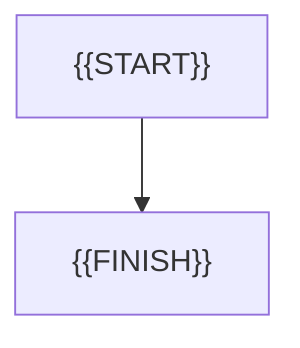

# {{FLOW_ID}}: {{FLOW_TITLE}}

- Идентификатор: {{FLOW_ID}}
- Сценарий: {{USE_CASE_ID}}
- Модуль: {{MODULE_ID}}
- Последнее обновление: {{DATE}}

{{FLOW_SUMMARY}}

## Процесс

## Связанные документы

- [{{USE_CASE_ID}}]({{USE_CASE_LINK}})
